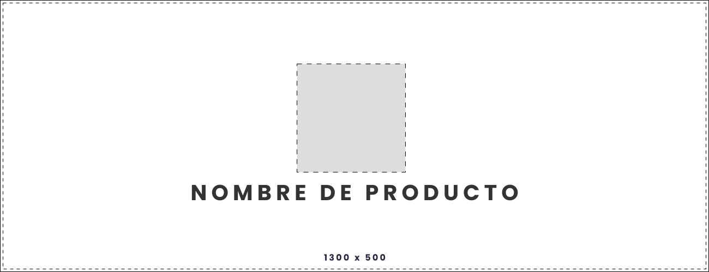

# **Web Develop BackEnd Template**

    

Bienvenido al repositorio oficial del proyecto **[Project-API](https://github.com/repository/Project-API)**, donde aquí se aloja el código fuente de la aplicación en calidad de backend, una REST API construido con Node JS y TypeScript.

## **Tópicos**

Conoce otros aspectos generales del proyecto:

- ✨ **[Mesa de Trabajo Gana +](https://www.notion.so/cistemmx/Cistem-Gana-1ed1b42f9c64800ea571d811dc4182de?source=copy_link)**
- ✨ **[Recursos para Publicación de Servicios](https://www.notion.so/cistemmx/Desarrollos-1ca1b42f9c6480b0b842cbbf5090bc68?source=copy_link)**

 

---
&copy; 2025 Cistem Innovacion S.A. de C.V. | Todos los derechos reservados.